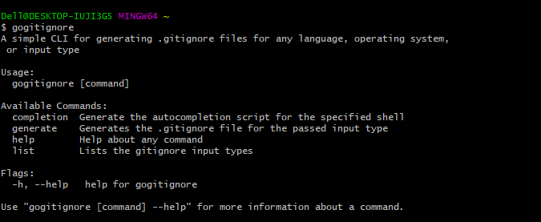

<h1 align="center">
  GOGITIGNORECLI
</h1>
<h4 align="center">
    Generate .gitignore files for your projects with ease 🚀.
</h4>

## Description 
This CLI tool is used for generating .gitignore files for any programming language using the [Toptal Gitignore API](https://www.toptal.com/developers/gitignore).

## Screenshot


## Installation 

### Install by downloading pre-compiled binaries 
You can easily download the pre-compiled binaries for your Linux, Windows, FreeBSD, or MAC OS from the [releases](https://github.com/rexsimiloluwah/gogitignorecli/releases) section. 

### Installing from GitHub using Go 
```bash 
$ go install github.com/rexsimiloluwah/gogitignorecli@latest
```

### Compile from source 
1. Clone the repository 
```bash
$ git clone https://github.com/rexsimiloluwah/gogitignorecli
$ cd gogitignorecli
```

2. Install 

## Usage 
```
Usage:
  gogitignore [command]

Available Commands:
  completion  Generate the autocompletion script for the specified shell
  generate    Generates the .gitignore file for the passed input type
  help        Help about any command
  list        Lists the gitignore input types

Flags:
  -h, --help   help for gogitignore

Use "gogitignore [command] --help" for more information about a command.

```
